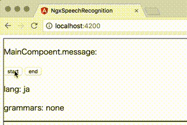

[](https://codeclimate.com/github/kamiazya/ngx-speech-recognition/maintainability) [](https://codeclimate.com/github/kamiazya/ngx-speech-recognition/test_coverage) [](https://badge.fury.io/js/%40kamiazya%2Fngx-speech-recognition) [](https://www.codacy.com/app/kamiazya/go-dispatcher?utm_source=github.com&amp;utm_medium=referral&amp;utm_content=kamiazya/go-dispatcher&amp;utm_campaign=Badge_Grade)

# NgxSpeechRecognition

[](https://nodei.co/npm/@kamiazya/ngx-speech-recognition/)

Angular 5+ speech recognition service (based on browser implementation such as Chrome).

## Demo



Run `ng serve` for a demo server. Navigate to `http://localhost:4200/`. The app will automatically reload if you change any of the source files.

## See

[Support Browsers](https://caniuse.com/#feat=speech-recognition)

[Web Speech API -- MDN](https://developer.mozilla.org/ja/docs/Web/API/Web_Speech_API)

## API

### RxSpeechRecognitionService

```typescript
import { Component } from '@angular/core';
import {
  RxSpeechRecognitionService,
  resultList,
} from '@kamiazya/ngx-speech-recognition';

@Component({
  selector: 'demo-rx',
  template: `
  <p>RxCompoent.message: {{message}}</p>
  <button
    [disabled]="service.started$ | async"
    (click)="listen()"
  >listen</button>
  <p>lang: ja</p>
  <p>grammars: none</p>
  `,
  styleUrls: ['./rx.component.css'],
  providers: [
    RxSpeechRecognitionService,
  ],
})
export class RxComponent {

  message = '';

  constructor(
    public service: RxSpeechRecognitionService,
  ) { }

  listen() {
    this.service
      .listen()
      .pipe(resultList)
      .subscribe((list: SpeechRecognitionResultList) => {
        this.message = list.item(0).item(0).transcript;
        console.log('RxComponent:onresult', this.message, list);
      });
  }

}
```

### Settings Example

#### Module Pattern

```typescript
import {
  SpeechRecognitionModule,
} from '@kamiazya/ngx-speech-recognition';

@NgModule({
  imports: [
    // load with configs.
    SpeechRecognitionModule.withConfig({
      lang: 'en-US',
      interimResults: true,
      maxAlternatives: 10,
    }),
  ],
})
export class DemoModule { }
```

#### Provider Pattern

Dependency Inject to `SpeechRecognitionService`.

```typescript
import {
  SpeechRecognitionLang,
  SpeechRecognitionMaxAlternatives,
  SpeechRecognitionGrammars,
  SpeechRecognitionService,
} from '@kamiazya/ngx-speech-recognition';

@Component({
  templateUrl: './sub.component.html',
  styleUrls: ['./sub.component.css'],
  providers: [
    {
      provide: SpeechRecognitionLang,
      useValue: 'en-US',
    },
    {
      provide: SpeechRecognitionMaxAlternatives,
      useValue: 1,
    },
    SpeechRecognitionService,
  ],
})
export class SubComponent { }
```

## License

[MIT](https://choosealicense.com/licenses/mit/)
